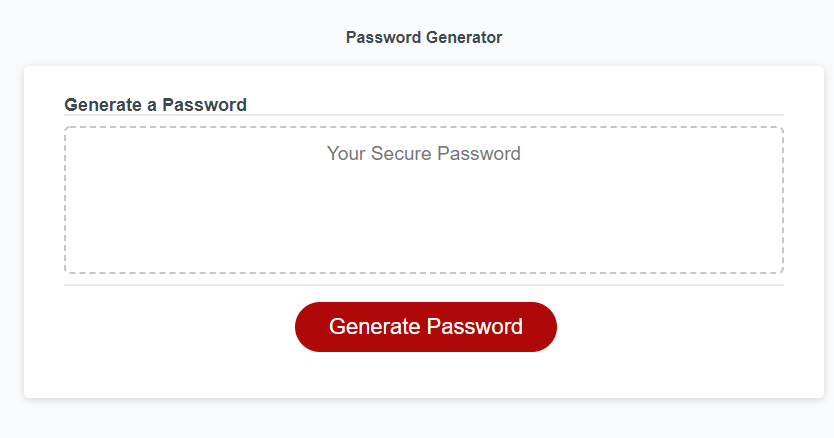

# The Gatekeeper Password Generator

## Description
This is a password generator application written using Javascript. It asks you for the required password length and the criteria that this password has to fulfill. It then creates your password and outputs it to you in a textbox. 

### Usage

You need to click on the 'Generate Password Button'. The browser will ask you what length you need your password to be. You must enter a value between 8 and 128 inclusive. It then runs you through several prompts to check what criteria you need your password to achieve. You must accept at least one of these criteria. The application has an error handling system in case you enter the wrong values or do not select a criteria.

## Link to the Deployed Application
[The Gatekeeper Password Generator](https://forester93.github.io/gatekeeper-password-generator/)

## Link to the Github Repository

[The Gatekeeper Password Generator Github Repo](https://github.com/Forester93/gatekeeper-password-generator/)

## Screenshot of the Application

## Contact me

|Name|Email|Phone Numer|
|----|-----|-----------|
|Mark Forester|markforester93@gmail.com|+61 (0) 404-831-362|

## Commits for this Application

### First Commit
• Created the markdown file.
### Second Commit
• Deployed the html, css and js files.
• Added a style reset file and linked it to index.html.
### Third Commit
• Gave repository a unique name.
• Changed title on the html page.
• Linked README.md to the screenshot of the page.
• Final test of the functionality of the deployed application.
